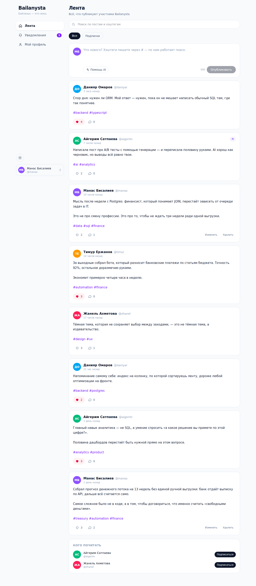
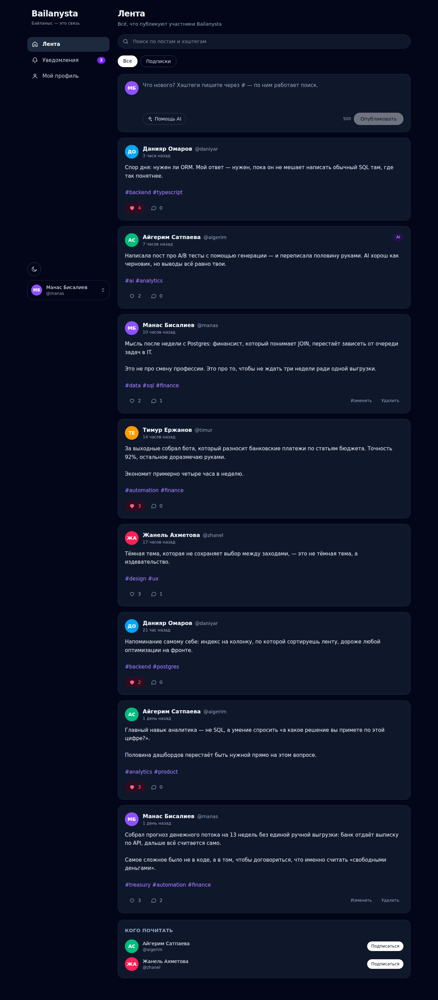
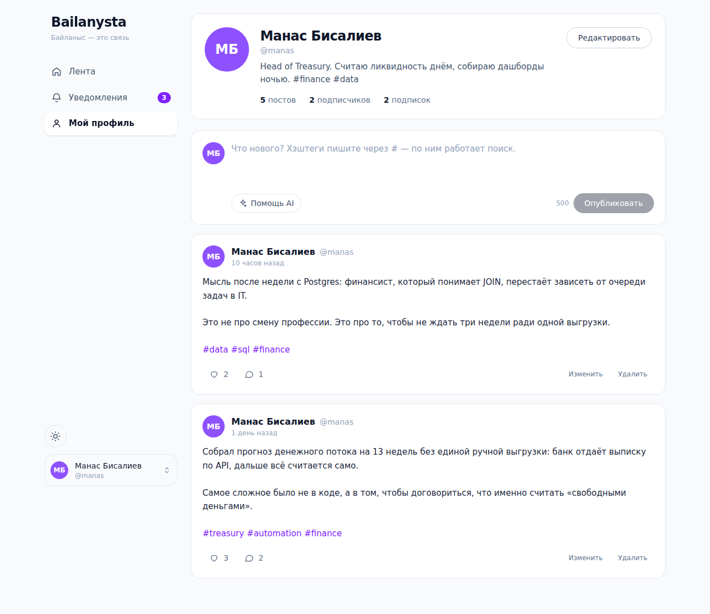
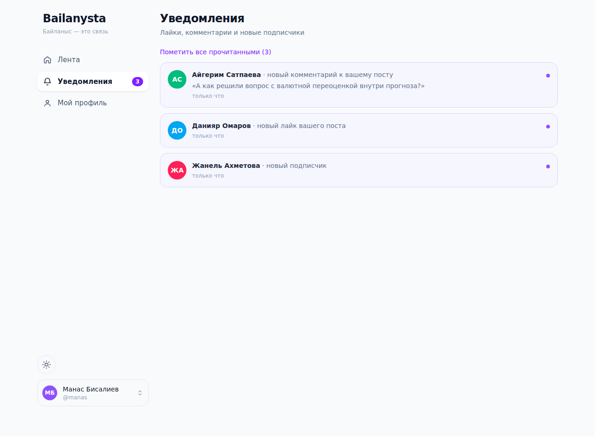
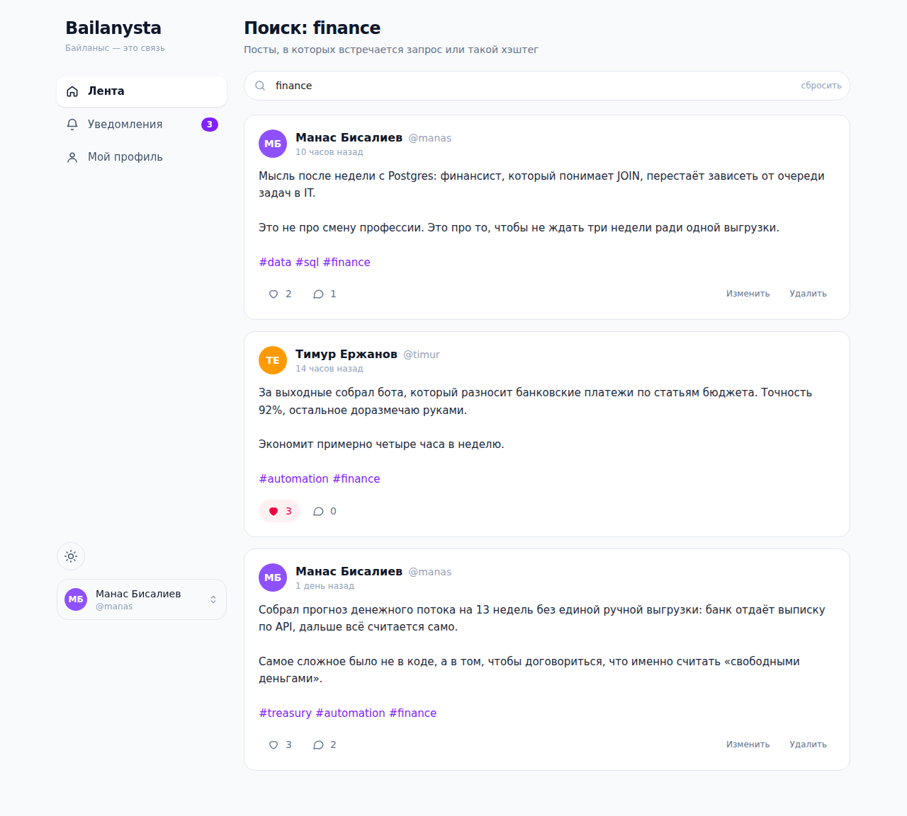
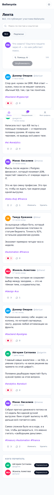

# Bailanysta

Социальная сеть: лента постов, профили, подписки, лайки, комментарии,
уведомления, поиск по хэштегам, тёмная тема и генерация черновиков через AI.

Учебный проект, выполненный по техническому заданию nFactorial School.
Закрыты все три уровня ТЗ и все бонусные пункты.

| | |
|---|---|
| **Демо** | `<ссылка на Vercel — добавить после деплоя>` |
| **Стек** | Next.js 16 (App Router) · TypeScript · PostgreSQL · Drizzle ORM · Tailwind CSS v4 |
| **Тесты** | 14 сквозных проверок в реальном браузере (Playwright) |



<details>
<summary>Ещё скриншоты: тёмная тема, профиль, уведомления, поиск, мобильная версия</summary>

| Тёмная тема | Профиль |
|---|---|
|  |  |

| Уведомления | Поиск |
|---|---|
|  |  |

| Мобильная версия |
|---|
|  |

</details>

---

## 1. Краткое описание проекта

Bailanysta (каз. *байланыс* — «связь») — веб-приложение социальной сети.

Что умеет:

- **Лента** — все посты участников, сортировка от новых к старым.
- **Лента подписок** — только те, на кого вы подписаны.
- **Профиль** — описание, счётчики постов / подписчиков / подписок, посты автора, редактирование своего профиля.
- **Посты** — создание, редактирование и удаление своих постов; чужие защищены на уровне сервера.
- **Лайки** — один лайк на пользователя (ограничение на уровне БД), оптимистичное обновление интерфейса.
- **Комментарии** — подгружаются лениво, по раскрытию.
- **Подписки** — на любого пользователя, кроме себя.
- **Уведомления** — о лайках, комментариях и новых подписчиках; счётчик непрочитанных в навигации.
- **Поиск** — по тексту поста и по хэштегу; запрос живёт в адресе страницы, поэтому результатом можно поделиться ссылкой.
- **Тёмная тема** — выбор сохраняется между сессиями, без «вспышки» белого экрана при загрузке.
- **AI-генерация** — черновик поста по теме; внешний сервис вызывается **только с сервера**.
- **Адаптивность** — три колонки на десктопе, нижняя панель навигации на телефоне.

### Соответствие уровням ТЗ

| Требование ТЗ | Где реализовано |
|---|---|
| **Ур. 1** Профиль с созданием постов | `src/app/u/[username]/page.tsx`, `src/components/PostComposer.tsx` |
| **Ур. 1** Лента с автором и текстом | `src/app/page.tsx`, `src/components/PostFeed.tsx` |
| **Ур. 1** Логичное дерево компонентов | `src/components/**` — см. раздел 3 |
| **Ур. 2** Собственный бэкенд и API | `src/app/api/**` — 10 эндпоинтов |
| **Ур. 2** Роутинг между страницами | App Router: `/`, `/u/[username]`, `/notifications` |
| **Ур. 3** Деплой | Vercel + Neon, инструкция ниже |
| **Бонус** Тёмная тема с сохранением | `src/components/providers/ThemeProvider.tsx` |
| **Бонус** Лайки и комментарии | `src/components/PostCard.tsx`, `CommentSection.tsx` |
| **Бонус** Создание и редактирование постов | `PostComposer.tsx`, `PostCard.tsx` |
| **Бонус** Подписки | `FollowButton.tsx`, `src/app/api/users/[username]/follow` |
| **Бонус** Уведомления | `src/app/notifications`, `NotificationsView.tsx` |
| **Бонус** Интеграция AI | `src/lib/ai.ts`, `src/app/api/ai/generate` |
| **Бонус** Лоадеры и скелетоны | `src/components/ui/Skeleton.tsx` |
| **Бонус** Поиск по словам и хэштегам | `SearchBar.tsx`, `listPosts()` в `src/lib/queries.ts` |
| **Обязательно** Внешние API только с сервера | `src/lib/ai.ts` помечен `server-only` |

---

## 2. Установка и запуск

### Что нужно

- Node.js 20 или новее
- PostgreSQL 14 или новее (локально либо облачный — например, [Neon](https://neon.tech), бесплатный тариф)

### Локальный запуск

```bash
# 1. Клонировать и установить зависимости
git clone https://github.com/<ваш-аккаунт>/bailanysta.git
cd bailanysta
npm install

# 2. Настроить переменные окружения
cp .env.example .env.local
# откройте .env.local и укажите строку подключения к своей базе

# 3. Создать таблицы и наполнить демо-данными
npm run db:push
npm run db:seed

# 4. Запустить
npm run dev
```

Приложение откроется на <http://localhost:3000>.

### Если Postgres ещё не установлен

Быстрее всего — поднять в Docker:

```bash
docker run --name bailanysta-db -e POSTGRES_USER=bailanysta \
  -e POSTGRES_PASSWORD=bailanysta -e POSTGRES_DB=bailanysta \
  -p 5432:5432 -d postgres:16
```

Строка подключения для `.env.local` при этом та, что уже лежит в `.env.example`.

### Команды

| Команда | Что делает |
|---|---|
| `npm run dev` | Запуск в режиме разработки |
| `npm run build` | Продакшен-сборка |
| `npm start` | Запуск собранного приложения |
| `npm run db:push` | Синхронизировать схему с базой |
| `npm run db:generate` | Сгенерировать SQL-миграцию |
| `npm run db:seed` | Заполнить базу демо-данными (пересоздаёт их) |
| `npm run db:studio` | Визуальный просмотрщик базы |
| `npm run lint` | Проверка ESLint |
| `npm run test:e2e` | Сквозные тесты в браузере (приложение должно быть запущено) |

### Переменные окружения

| Переменная | Обязательна | Назначение |
|---|---|---|
| `DATABASE_URL` | да | Строка подключения к PostgreSQL |
| `OPENAI_API_KEY` | нет | Ключ OpenAI. **Без него генерация работает** на встроенном офлайн-генераторе |
| `OPENAI_MODEL` | нет | Модель, по умолчанию `gpt-4o-mini` |

Ни одна из них не имеет префикса `NEXT_PUBLIC_`, поэтому все они доступны
только на сервере и не попадают в бандл браузера.

### Деплой на Vercel

1. Создайте бесплатную базу на [Neon](https://neon.tech) и скопируйте строку подключения.
2. Импортируйте репозиторий на [Vercel](https://vercel.com/new).
3. В настройках проекта → Environment Variables добавьте `DATABASE_URL`
   (и `OPENAI_API_KEY`, если нужна настоящая генерация).
4. Разверните проект.
5. Один раз создайте таблицы в облачной базе — локально, указав в `.env.local`
   строку от Neon:
   ```bash
   npm run db:push && npm run db:seed
   ```

---

## 3. Процесс проектирования и разработки

### Порядок работы

Разработка шла снизу вверх — от данных к интерфейсу, а не наоборот:

1. **Модель данных.** Сначала — какие сущности существуют и как связаны:
   пользователи, посты, лайки, комментарии, подписки, уведомления.
   Ограничения вроде «один лайк на пользователя» заданы первичным ключом
   в таблице, а не проверкой в коде — база не даст их нарушить даже при
   двойном клике или гонке запросов.

2. **Слой доступа к данным** (`src/lib/queries.ts`). Все SQL-запросы живут
   в одном файле. Бизнес-правила («автор не получает уведомление о своём
   лайке», «редактировать можно только свой пост») тоже здесь, а не
   размазаны по эндпоинтам.

3. **API** (`src/app/api/**`). Тонкий слой: разобрать HTTP-запрос, вызвать
   функцию из слоя данных, вернуть JSON. В каждом эндпоинте — несколько строк.

4. **Интерфейс** (`src/components/**`). Компоненты обращаются только к нашему
   API и ничего не знают о базе.

Такой порядок означал, что к моменту написания первого компонента API уже
можно было проверить через `curl` — и ошибки нашлись раньше, чем появился
интерфейс.

### Дерево компонентов

```
RootLayout
└── ThemeProvider                 — светлая / тёмная тема
    └── SessionProvider           — текущий пользователь, счётчик уведомлений
        └── AppShell              — навигация и раскладка
            ├── ThemeToggle
            ├── UserSwitcher
            └── {страница}
                ├── / ............ FeedPage
                │                  ├── SearchBar
                │                  ├── PostFeed
                │                  │   ├── PostComposer  (+ панель AI)
                │                  │   └── PostCard × N
                │                  │       ├── PostContent  (хэштеги → ссылки)
                │                  │       └── CommentSection
                │                  └── Suggestions → FollowButton
                ├── /u/[username]  ProfileView → FollowButton + PostFeed
                └── /notifications NotificationsView
```

Принцип разделения: **состояние живёт там, где оно нужно**. Тема и текущий
пользователь — глобальные, они в контекстах. Раскрыты ли комментарии
конкретного поста — локальное состояние `PostCard`, и поднимать его выше
незачем.

`PostFeed` намеренно сделан универсальным: он же показывает общую ленту,
ленту подписок и посты одного автора — разница только в параметрах запроса.

### Как данные идут через приложение

Пример — постановка лайка:

```
Клик в PostCard
  → оптимистично меняем счётчик в UI (мгновенно)
  → api.post('/api/posts/12/like')
      → route handler читает cookie сессии
      → toggleLike() в queries.ts:
            есть лайк?  → удалить
            нет лайка?  → вставить + создать уведомление автору
      → пересчитать количество лайков в SQL
  → подставляем настоящее число с сервера
  (ошибка → откатываем UI к прежнему состоянию)
```

---

## 4. Уникальные подходы и методологии

**Требование «внешние API только с сервера» проверяется сборкой, а не
дисциплиной.** Модуль `src/lib/ai.ts` помечен директивой `server-only`:
случайный импорт в клиентский компонент уронит сборку с понятной ошибкой.
Это сильнее, чем комментарий «не импортировать на клиенте».
Проверить можно так — в собранном бандле браузера нет ни ключа, ни адреса OpenAI:

```bash
npm run build
grep -r "OPENAI_API_KEY" .next/static/   # ничего не найдёт
grep -r "api.openai.com" .next/static/   # ничего не найдёт
```

**AI-функция не падает без ключа.** Если `OPENAI_API_KEY` не задан, сервис
недоступен или вернул ошибку — включается встроенный генератор черновиков,
а пользователь видит честное пояснение, что сработал запасной вариант.
Проверяющий может запустить проект без ключа и всё равно увидеть работающую
функцию. Внешний сервис не должен ронять приложение.

**Ошибки валидации отличаются от сбоев сервера.** Класс `AppError`
(`src/lib/errors.ts`) несёт с собой HTTP-статус, поэтому пустой пост даёт
`400`, чужой пост — `403`, несуществующий — `404`, и только настоящая
поломка — `500`. Без этого любая опечатка пользователя выглядела бы как
падение сервера.

**Оптимистичные обновления.** Лайки и подписки меняют интерфейс мгновенно,
не дожидаясь сети, и откатываются при ошибке. Разница в ощущениях —
между «приложение» и «сайт, который думает».

**Скелетоны повторяют форму реального контента.** Они занимают то же место,
что и данные, поэтому страница не прыгает в момент загрузки.

**Тёмная тема без «вспышки».** Синхронный скрипт в `<head>` выставляет класс
темы до первой отрисовки. Если делать это в `useEffect`, пользователь
в тёмной теме каждый раз видит белый экран на долю секунды.

**Хэштеги хранятся отдельной колонкой-массивом,** а не ищутся регуляркой
по тексту при каждом запросе. Поиск по тегу становится точным (`#fin`
не находится внутри `#finance`) и работает по индексу.

**Защита от XSS без усилий.** Текст поста рендерится как React-узлы,
`dangerouslySetInnerHTML` не используется нигде, кроме скрипта темы.
Вставить в пост чужую разметку невозможно.

**Сквозные тесты вместо ручной проверки.** `npm run test:e2e` открывает
настоящий браузер и проверяет 14 сценариев: публикация, лайк и его
сохранение в базе, комментарий, редактирование, поиск, переключение темы
и её сохранение после перезагрузки, роутинг, подписка, уведомления, смена
пользователя, генерация через AI. Тесты также ловят любые ошибки в консоли.

---

## 5. Компромиссы

Каждый из них — осознанный выбор, а не то, что «не успелось».

**Нет паролей и настоящей аутентификации.** В ТЗ её нет, а делать «почти
настоящую» авторизацию хуже, чем не делать никакой: она создаёт ложное
чувство защиты. Вместо неё — переключатель пользователя: id лежит
в `httpOnly`-cookie, JavaScript в браузере его не прочитает. Для проверяющего
это удобнее регистрации: можно за два клика посмотреть на приложение глазами
другого человека и убедиться, что лайки, подписки и права на редактирование
действительно работают. Для продакшена сюда встал бы NextAuth или Clerk —
слой сессии для этого уже изолирован в `src/lib/session.ts`.

**Клиентская загрузка данных вместо серверного рендеринга ленты.**
Серверные компоненты Next.js могли бы ходить в базу напрямую и отдавать
готовый HTML — быстрее и лучше для SEO. Но ТЗ уровня 2 требует именно
интеграцию собственного API, и явная граница «браузер → наш API → база»
делает архитектуру очевидной и для проверяющего, и для будущего мобильного
клиента. Плата — первая отрисовка показывает скелетоны. Для соцсети,
где контент персонализирован и закрыт от поисковиков, это приемлемо.

**Нет пагинации в интерфейсе.** API умеет `limit` и `offset`, но кнопки
«показать ещё» нет: на демо-данных она не нужна. На реальном объёме
это первое, что стоит добавить.

**Нет загрузки изображений.** ТЗ прямо разрешает обойтись без них.
Аватары — цветные кружки с инициалами: узнаваемо, не требует хранилища
и не ломается на пустых значениях.

**Уведомления не приходят в реальном времени.** Они создаются на сервере
сразу, но появляются при заходе на страницу. Вебсокеты или SSE ради
учебного проекта — это отдельный слой инфраструктуры, который придётся
поддерживать и на Vercel настраивать отдельно.

**Нет SWR / React Query.** Для трёх экранов хватает `useState` + `useEffect`,
завёрнутых в тонкий клиент `src/lib/client.ts`. Библиотека кэширования дала бы
выигрыш на приложении в несколько раз больше — здесь она добавила бы
зависимость и понятийную нагрузку без отдачи.

**Drizzle вместо Prisma.** Prisma популярнее и была первым выбором, но она
требует скачивания бинарных движков при установке — в закрытой сети это
делает проект неустанавливаемым. Drizzle — чистый TypeScript: `npm install`
и всё работает где угодно. Подробнее — в разделе 7.

**Тесты сквозные, а не модульные.** Юнит-тестов нет: на проекте такого
размера 14 сценариев в настоящем браузере ловят больше реальных поломок,
чем два десятка тестов на отдельные функции. На растущем проекте к ним
добавились бы модульные тесты слоя данных.

---

## 6. Известные проблемы и ограничения

- **Нет пагинации в UI.** Лента отдаёт последние 20 постов. API это умеет,
  интерфейс — нет.
- **Поиск по тексту использует `ILIKE`**, то есть подстроку. Он не знает
  морфологии: запрос «автоматизация» не найдёт «автоматизировать».
  Правильное решение — полнотекстовый поиск Postgres (`tsvector` + `GIN`),
  это следующий шаг.
- **Счётчик уведомлений не обновляется сам.** Он перечитывается при
  переходах между страницами и при смене пользователя, но если держать
  вкладку открытой, новое уведомление появится только после навигации.
- **Уведомление остаётся после отмены действия.** Сняли лайк — уведомление
  о нём не удаляется. Так же ведут себя многие реальные соцсети, но это
  осознанное упрощение, а не задумка.
- **Пометка «AI» остаётся после ручной правки.** Если сгенерировать черновик
  и полностью его переписать, пост всё равно помечен значком AI. Выбрано
  сознательно: лучше пометить лишнее, чем скрыть происхождение текста.
- **`npm audit` показывает предупреждения** в транзитивных зависимостях
  инструментов разработки (`drizzle-kit`). На рантайм приложения они
  не влияют; исправление ждёт обновления вышестоящих пакетов.
- **Тесты пишут в ту же базу**, на которую указывает запущенное приложение.
  Запускать их против продакшена нельзя; после прогона стоит выполнить
  `npm run db:seed`, чтобы вернуть чистые демо-данные.
- **При первом заходе без cookie** пользователем становится первый
  в базе. Это следствие отказа от регистрации, см. раздел 5.

---

## 7. Почему такой технический стек

### Next.js 16 (App Router)

ТЗ требует и фронтенд, и собственный бэкенд. Next.js даёт их в одном
проекте: страницы и API-эндпоинты лежат рядом, типы между ними общие,
деплой один. Альтернатива — отдельные React + Vite и Express — это два
репозитория или монорепо, две сборки, настройка CORS и два деплоя.
Для задачи такого объёма это лишняя сложность без выигрыша.

App Router (а не Pages Router) — потому что это текущий рекомендуемый
подход, в нём вложенные layout'ы дают навигацию без перерисовки всей
страницы, а route handlers — нормальный REST-бэкенд.

### TypeScript

Типы здесь выводятся из схемы базы и доходят до компонентов. Опечатка
в имени поля ловится при сборке, а не в проде. На проекте, где данные
проходят через четыре слоя, это экономит больше времени, чем стоит.

### PostgreSQL

Модель данных — реляционная по своей природе: пользователи, посты, лайки
и подписки связаны между собой. Ограничение «один лайк на пользователя»
выражается составным первичным ключом в одну строку схемы, и база
гарантирует его при любой конкуренции запросов. В документной БД это
пришлось бы проверять в коде — с гонками и рассинхроном счётчиков.
Плюс Postgres бесплатно доступен на Neon и Supabase, и Vercel с ним
работает из коробки.

### Drizzle ORM

Изначально выбор был в пользу Prisma, но она скачивает бинарные движки
запросов при установке. В окружении с ограниченным доступом к сети
(корпоративный прокси, закрытый CI) установка падает, и проект
невозможно собрать. Drizzle — чистый TypeScript без бинарников:
`npm install` работает везде.

Помимо этого Drizzle оказался удачным выбором по сути: его запросы
близки к SQL, поэтому видно, какой именно запрос уйдёт в базу, а типы
выводятся из схемы автоматически. Там, где нужен подзапрос для подсчёта
лайков, можно написать обычный SQL и не терять типизацию.

### Tailwind CSS v4

Стили лежат рядом с разметкой, что для компонентного интерфейса удобнее,
чем отдельные файлы и придумывание имён классов. Тёмная тема — это
модификатор `dark:` у нужных классов, а не второй набор стилей.
В v4 конфигурация переехала в CSS, поэтому в проекте нет `tailwind.config.js`.

### Playwright

Сквозные тесты в настоящем браузере проверяют то, что реально важно:
что пользователь может опубликовать пост и лайк не исчезает после
перезагрузки. Playwright ставится одной командой и не требует
инфраструктуры вокруг себя.

### Чего в проекте намеренно нет

- **Библиотеки состояния** (Redux, Zustand) — двух React-контекстов достаточно.
- **UI-китов** (MUI, shadcn) — компонентов немного, свои дают полный контроль
  над внешним видом и не тянут лишний вес.
- **date-fns / moment** — две функции форматирования дат написаны вручную,
  это 40 строк против отдельной зависимости.

---

## Структура проекта

```
src/
├── app/
│   ├── api/                  # Бэкенд: 10 REST-эндпоинтов
│   │   ├── ai/generate/      # Серверный вызов OpenAI
│   │   ├── me/               # Текущий пользователь
│   │   ├── notifications/
│   │   ├── posts/            # Лента, CRUD, лайки, комментарии
│   │   └── users/            # Профили и подписки
│   ├── notifications/        # Страница уведомлений
│   ├── u/[username]/         # Страница профиля
│   ├── page.tsx              # Лента
│   └── layout.tsx            # Провайдеры и каркас
├── components/
│   ├── providers/            # Тема и сессия
│   └── ui/                   # Аватар, скелетоны, состояния, переключатель темы
├── db/
│   ├── schema.ts             # Таблицы и связи
│   ├── index.ts              # Пул соединений
│   └── seed.ts               # Демо-данные
└── lib/
    ├── queries.ts            # Все запросы к базе и бизнес-правила
    ├── ai.ts                 # Генерация (server-only)
    ├── session.ts            # Текущий пользователь
    ├── client.ts             # Клиентская обёртка над fetch
    ├── errors.ts             # Ошибки с HTTP-статусами
    ├── hashtags.ts
    └── format.ts
tests/e2e.mjs                 # Сквозные тесты
docs/API.md                   # Справочник по эндпоинтам
ARCHITECTURE.md               # Подробный разбор архитектуры
```

## Справочник API

Полное описание — в [docs/API.md](docs/API.md).

| Метод | Путь | Назначение |
|---|---|---|
| `GET` | `/api/posts` | Лента. Параметры: `query`, `author`, `following`, `limit`, `offset` |
| `POST` | `/api/posts` | Создать пост |
| `GET` `PATCH` `DELETE` | `/api/posts/:id` | Получить, изменить, удалить пост |
| `POST` | `/api/posts/:id/like` | Поставить или снять лайк |
| `GET` `POST` | `/api/posts/:id/comments` | Комментарии |
| `GET` | `/api/users` | Список пользователей / рекомендации |
| `GET` | `/api/users/:username` | Профиль |
| `POST` | `/api/users/:username/follow` | Подписаться или отписаться |
| `GET` `PUT` `POST` `PATCH` | `/api/me` | Текущий пользователь: получить, сменить, создать, изменить |
| `GET` `PATCH` | `/api/notifications` | Уведомления и пометка прочитанными |
| `POST` | `/api/ai/generate` | Генерация черновика поста (внешний вызов — с сервера) |
